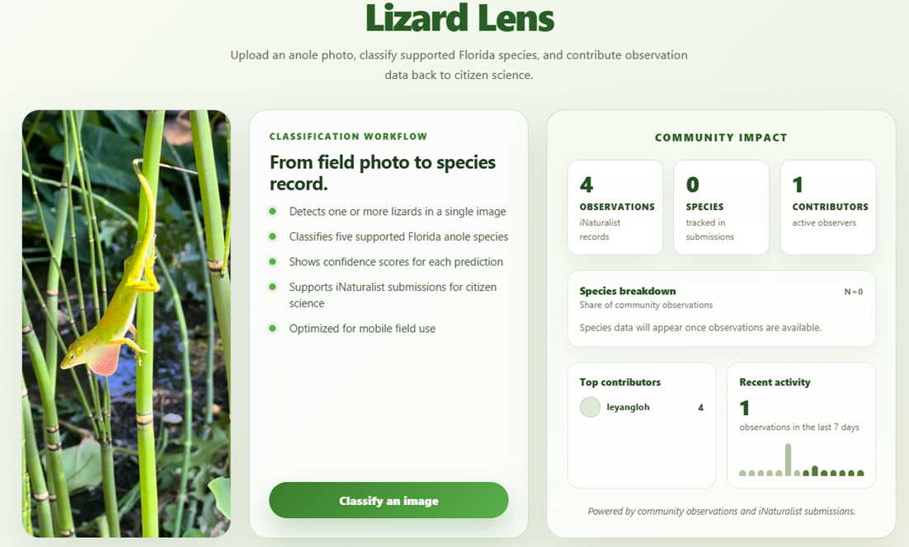

# Lizard Lens

A full-stack web application for detecting and classifying 5 Florida anole species from uploaded images using a 2-stage machine learning pipeline.

<p align="center">
  
</p>

## What This Does

- **2-Stage ML Pipeline**: 
  1. YOLOv8x detection to locate lizards in images 
  2. Swin Transformer classification of cropped lizard images for species identification
- **5 Species Support**: Green Anole, Brown Anole, Crested Anole, Knight Anole, Bark Anole
- **Multi-Detection**: Can detect and classify multiple lizards in a single image
- **Flexible Inference**: Server-side PyTorch inference on CPU
- **Confidence Scoring**: Shows confidence levels for each species prediction with visual indicators
- **Mobile Support**: Responsive design optimized for mobile devices

<p align="center">
  
</p>

## Architecture

- **Backend**: FastAPI server with PyTorch
- **Frontend**: React + TypeScript with Vite
- **Models**: 
  - YOLOv8x for anole detection (640x640 input)
  - Swin Transformer Base for species classification (384x384 input)
- **Inference Modes**:
  - **CPU (Default)**: PyTorch on server CPU - balanced performance

## Quick Start

### Prerequisites

**Backend:**
- Python 3.9+
- Conda (recommended)

**Frontend:**
- Node.js 18+
- npm or yarn

### 1. Start the Backend

```bash
# Navigate to backend directory
cd backend

# Activate conda environment
conda activate anole-classifier

# Install dependencies (first time only)
pip install -r requirements.txt

# Start the FastAPI server
python -m uvicorn app.main:app --host 0.0.0.0 --port 8000 --reload
```

The backend API will be available at `http://localhost:8000`
- API docs: `http://localhost:8000/api/docs`
- Health check: `http://localhost:8000/health`

### 2. Start the Frontend

```bash
# In a new terminal, navigate to frontend directory
cd frontend

# Install dependencies (first time only)
npm install

# Start the development server
npm run dev
```

The application will be available at `http://localhost:5173`

## Inference Modes

The application supports server-side CPU inference:

### 1. **CPU Mode (Default)** 
```
http://localhost:5173/predict
```
- Uses PyTorch on server CPU
- Good balance of speed and accuracy
- Recommended for all use cases
- No GPU required

## Project Structure

```
Anole_classifier/
├── backend/                       # FastAPI backend
│   ├── app/
│   │   ├── models/               # ML model loading and pipeline
│   │   │   ├── pipeline.py       # 3-stage pipeline orchestration
│   │   │   └── model_loader.py   # Singleton model loader
│   │   ├── routers/              # API endpoints
│   │   │   └── predict.py        # Prediction endpoints
│   │   ├── services/             # Business logic
│   │   │   ├── pipeline_inference.py      # PyTorch inference
│   │   │   └── onnx_pipeline_inference.py # ONNX inference
│   │   └── main.py               # FastAPI app initialization
│   └── requirements.txt          # Python dependencies
│
├── frontend/                      # React frontend
│   ├── src/
│   │   ├── pages/
│   │   │   ├── LandingPage.tsx   # Welcome screen
│   │   │   └── PredictionPage.tsx # Main classification interface
│   │   ├── services/
│   │   │   ├── OnnxDetectionService.ts   # Browser ONNX inference
│   │   │   ├── AnoleDetectionService.ts  # Unified detection API
│   │   │   └── config.ts                 # API configuration
│   │   └── App.tsx               # Main app component
│   ├── public/                   # ONNX WASM files
│   └── package.json              # Node dependencies
│
├── Dataset/  					  # Stores datasets
│
├── Spring_2025/
│   ├── models/                   # Trained ML models
│   │   ├── yolov8x/             # YOLOv8x detection models
│   │   │   ├── best.pt          # PyTorch weights
│   │   │   └── best.onnx        # ONNX format
│   │   ├── swin_transformer_base_lizard_v4/  # Swin classification
│   │   ├── yolo_best.onnx       # Standalone YOLO ONNX
│   │   └── swin_model.onnx      # Standalone Swin ONNX
│   ├── notebooks/                
│   │   ├── *.ipynb/             # Training notebooks
│   ├── inference/           	 # Pipeline evaluation results are stored here
│
└── docs/                         # Documentation
    ├── ONNX_SETUP.md            # ONNX setup guide
    ├── API_USAGE_GUIDE.md       # API usage examples
    └── ...
```

## API Usage Examples

### Python
```python
import requests

# Default CPU inference
with open("lizard.jpg", "rb") as f:
    response = requests.post(
        "http://localhost:8000/api/predict",
        files={"file": f}
    )
print(response.json())


```

### cURL
```bash
# Default CPU inference
curl -X POST "http://localhost:8000/api/predict" \
  -F "file=@lizard.jpg"
```

## Training and Evaluation

### Dataset preparation
- Download the datasets and store them in the `./Dataset` directory.
- The end-to-end pipeline evaluation expects the test split of the `florida_five_anole_10000_v4` dataset, with images and YOLO-format labels at:
	- `INPUT_IMAGE_FOLDER`: `../Dataset/yolo_training/florida_five_anole_10000_v4/test/images`
	- `INPUT_LABEL_FOLDER`: `../Dataset/yolo_training/florida_five_anole_10000_v4/test/labels`

### Stage 1 - Lizard Detection Model Training
- Fine-tune the YOLOv8x detection model using `./Spring_2025/notebooks/object_detection_train yolov8x_dataset_v4_pipeline.ipynb`.
- Training configuration (per the notebook):
	- Base weights: `yolov8x.pt`
	- Epochs: 100
	- Image size: 640
	- Batch size: 48
- Validation on the test dataset reports mAP@0.50, mAP@0.75, mAP@0.50-0.95, precision, recall, F1-score, and inference speed.
- Alternative detection backbones (YOLOv8 small/medium/large/extra-large, YOLOv11, YOLOv12) can be trained via the other `object_detection_train_*.ipynb` notebooks in the same folder.

### Stage 2 - Classification Model Training
- Fine-tune the Swin Transformer (Base) classifier on the cropped lizard dataset using `./Spring_2025/notebooks/classification_train_hugging_face.ipynb`.
- Training configuration (per the notebook):
	- Base checkpoint: `microsoft/swin-base-patch4-window12-384`
	- Epochs: 30
	- Per-device batch size: 128
	- Gradient accumulation steps: 4
	- Learning rate: 5e-5
	- Warmup ratio: 0.1
	- Best model selected by validation accuracy (`metric_for_best_model="accuracy"`, `load_best_model_at_end=True`)
- Each training notebook also produces evaluation against the test split, reporting precision, recall, F1-score, and a confusion matrix.

### End-to-end evaluation of LizardLens (pipeline)
- Place the fine-tuned YOLOv8x and Swin Transformer weights so that `pipeline_evaluation.py` can load them via the module-level paths at the top of the file:
	- `YOLO_MODEL_FILE_PATH` -> path to the YOLOv8x `best.pt`
	- `SWIN_MODEL_FILE_PATH` -> path to the fine-tuned Swin Transformer checkpoint directory
- Update the evaluation thresholds at the top of `pipeline_evaluation.py` as needed:
	- `CONF_THRESH` (default `0.5`) - YOLO detections below this confidence are discarded
	- `NMS_IOU_THRESHOLD` (default `0.25`) - IoU threshold for non-maximum suppression; overlapping detections are grouped and only the highest-confidence box per group is kept
	- `TOP_K` (default `5`) - maximum number of detections per image passed to the classifier (set `None` for no limit)
	- `EVAL_IOU_THRESHOLD` (default `0.2`) - minimum IoU required between a prediction and a ground-truth box for them to be matched during evaluation
- Run the pipeline:
	- `python pipeline_evaluation.py`, or run `pipeline_evaluation.ipynb` / `pipeline_evaluation_pipeline.ipynb`
- Pipeline behaviour, per image in the test set:
	1. YOLOv8x predicts bounding boxes; detections are filtered by `CONF_THRESH`, deduplicated via NMS at `NMS_IOU_THRESHOLD`, sorted by confidence, and trimmed to the top `TOP_K`.
	2. Each surviving box is cropped and classified by the fine-tuned Swin Transformer.
	3. Predictions are greedy-matched to ground-truth boxes using IoU >= `EVAL_IOU_THRESHOLD`; matched (y_true, y_pred) pairs are recorded.
	4. Unmatched ground-truth boxes are recorded as **missed detections** (`y_pred = MISSED_CLASS_ID = 5`).
	5. Unmatched predictions are recorded as **false positives** (`y_true = MISSED_CLASS_ID = 5`).
	6. Matched predictions whose class differs from the ground-truth class are additionally saved as **misclassifications**.
- Outputs are written to a new run directory `./Spring_2025/inference/run_<YYYYMMDD_HHMMSS>/`:
	- `eval_results.csv` - `(y_true, y_pred)` pairs for every detection across the test set
	- `annotated_images/` - every test image annotated with ground-truth boxes (blue) and predicted boxes (red, with predicted class and detection confidence)
	- `missed_detections/` - annotated copies of images containing at least one unmatched ground-truth box
	- `false_positives/` - annotated copies of images containing at least one unmatched prediction
	- `mis_classification/` - annotated copies of images where a matched prediction had the wrong class
	- A scikit-learn `classification_report` printed to stdout, with per-class precision, recall, and F1 across the five anole classes plus a `Background` row that aggregates missed detections and false positives.

### End-to-end evaluation of other models
- Place alternative detection or classification weights in the same directory referenced by `YOLO_MODEL_FILE_PATH` / `SWIN_MODEL_FILE_PATH` and update the paths at the top of `pipeline_evaluation.py`.
- Variants of the pipeline evaluation notebook are provided for other detection backbones, e.g. `pipeline_evaluation_yolov8.ipynb` and `pipeline_evaluation_yolov12.ipynb`. Each follows the same overall structure as `pipeline_evaluation.py`.

## Documentation

- [ONNX Setup Guide](docs/ONNX_SETUP.md) - Complete guide for ONNX inference
- [API Usage Guide](docs/API_USAGE_GUIDE.md) - Detailed API documentation
- [Frontend Quick Start](docs/FRONTEND_QUICKSTART.md) - Frontend development guide

## License

[Add license information here]
