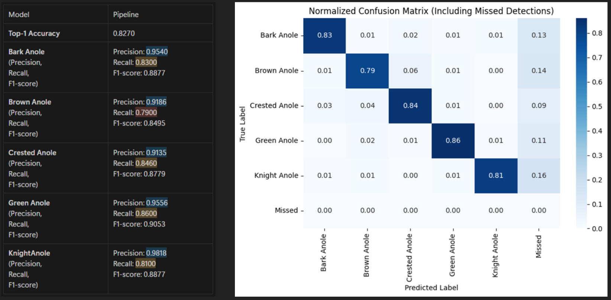
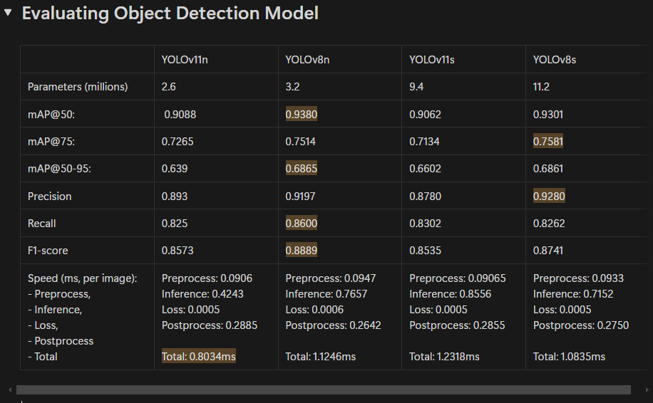
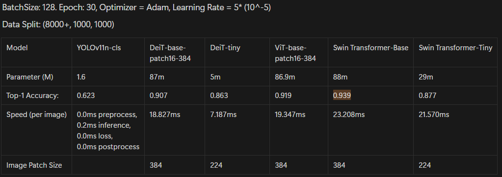

# Introduction

The Florida Anole Species Classification project aims to develop a robust machine learning pipeline for identifying five common Anolis species from photographs, primarily to support a community science initiative with middle school students in Miami. Building upon an extensive dataset of over 80,000 verified iNaturalist photographs, the classification pipeline achieved <ins>82.5% accuracy</ins> (compared to a random baseline of 20%). 

The development of this classification pipeline will serve as the foundation for a broader educational tool, whether implemented as a mobile application or web platform, that enables students to receive immediate probability-based species identification feedback before submitting their observations to iNaturalist, thereby enhancing the quality of citizen science data collection while engaging young students in herpetological research. 

  

## Method 
We proposed a classification pipeline that consist of 3 stages: 
1) Detecting lizard species using fine-tuned lizard detection model (Improvement👈)
2) Crop image using predicted bounding box from stage 1. (Completed👍)
3) Classifying cropped images using fine-tuned classification model to identify lizard subspecies. (Completed👍)

## Results

#### Overall Result
Overall, the classification pipeline achieved <ins>82.7% classification accuracy </ins>. The precision, recall and f1-score of each class is shown in the image below. 
- Generally, the pipeline achieved <ins>high precision (above 90%)</ins> across all lizard classes.
- Furthermore, the pipeline scored a relatively <ins>high recall (above 80%)</ins> for all lizard classes except for Brown Anole.
  
The confusion matrix displayed the prediction for the 5 lizard classes and the number of missed detection in stage 1 of the pipeline (lizard detection model).
- Evidently, the graph shows that the <ins>high number of missed detection (9-16%) from the lizard detection model</ins> affected the recall of each class's classification result.
- As such, **to improve the overall accuracy of the pipeline, we aim to improve the accuracy of the lizard detection model.**

  

Next, we will go into the details of the results of each stage of the pipeline as well as the rationale for the chosen metric and models.

#### Stage 1 - Lizard Detection Model

  

- **Recall** - YOLOv8n scored the best with a <ins>recall value of 86%</ins>. Recall is the most important metrics because achieving high recall indicates less missed detections. This is vital because in the entire 3-stage pipeline, the object detection serves as the first model and it is responsible for detecting the target. Missing the target would mean no image gets passed downstream, resulting in no classification performed at all and affecting the entire pipeline’s result. 
- **mean Average Precision (mAP) at high Intersection over Union (IoU)** is the next most important metric. In the first stage of the pipeline, we will filter predictions using a high IoU value to create a better localized bounding box around the lizard. This helps to preserve and capture the key features of the lizard in the cropped image, before being passed downstream to the classification model. Thus, we value mAP @ high IoU of 75 and 50-95. YOLOv8n achieved the 2nd highest (only differing from the top scorer by 0.007) and highest mAP for IoU of 75 and 50-95 respectively.
- **Considering the high Recall, F1-score and mAP results, YOLOv8n was chosen as the lizard detection model.**

#### Stage 3 - Classification Model
From the images below, the Swin Transformer (Base) model was the most performant with a score of <ins>93.9% for Top-1 accuracy</ins>. Furthermore, it achieved highest number of classified classes with above 90% precision (as highlighted in green). Therefore, the fine-tuned Swin Transformer (Base) model was chosen as the classification model for cropped lizard images.

  

## Installation:
    cd Anole_classifier
    
    conda create -f requirements_window.yml
    conda install -c conda-forge cudatoolkit=11.2 cudnn=8.1.0
    pip install "tensorflow<2.11" 

## Dataset 
The dataset are categorized as such:

**Original Dataset**

- Name: [original_compressed](https://gtvault-my.sharepoint.com/:f:/g/personal/wchia7_gatech_edu/EslddAlvkiFIh6r50UyBh8MBzS3tVwwrRXStT9aDARu8gQ?e=2bbj8W)
- Purpose:
	- Contains the original images sourced from the iNaturalist database.
	- Dataset only contains images that shows distinct features of the anole species. Distinct features are validated by researcher. 
	- Split into 5 individual classes of 2000 counts
- Directory
	- bark_anole, brown_anole, crested_anole, green_anole, knight_anole
		- Images and labels
	    
**YOLO Object detection Training**

- Name: [lizard_10000_v2](https://gtvault-my.sharepoint.com/:u:/g/personal/wchia7_gatech_edu/EZ1vNlKDSLxDhUXPM3QCkIQB_yG2ge26Now7bylg9b1KWg?e=1CeWSx)
- Purpose:
	- Contains anole images from the original dataset. Re-organized into COCO format for YOLO detection models training. 
- Description:	
	- Each folder has same number of counts from each class.
	- But all labels contains “lizard” class and bounding box coord.
- Directory:
	- Train / Valid / Test (8000, 1000, 1000)
    	- Images / Labels
	    
**Classification Training**

- Name: [cropped_lizard_10000](https://gtvault-my.sharepoint.com/:u:/g/personal/wchia7_gatech_edu/EbSmMeZ4fAtPleRnmkD32ogB4HBcJ2u-6y9Jp9kWzvAedw?e=7OOMyk)
- Purpose:
	- Contains anole images from the original dataset. Re-organized into format suitable for classification model training from Ultralytics or HuggingFace API.
- Description:
	- No labelling needed, only provided folders of images
- Directory:
	- Train / Valid / Test
    		- bark_anole, brown_anole, crested_anole, green_anole, knight_anole
	    
**End-to-end Dataset (florida_five_anole)**

- Name: [florida_five_anole_10000](https://gtvault-my.sharepoint.com/:u:/g/personal/wchia7_gatech_edu/EbSmMeZ4fAtPleRnmkD32ogB4HBcJ2u-6y9Jp9kWzvAedw?e=7OOMyk)
- Purpose:
	- The primary dataset for validating the performance of the 3 stage pipeline (Lizard Detection -> Crop -> Classification)  
- Description:
	- Similar layout to YOLO Object Detection training dataset
	- But all labels contains the respective class name and bounding box coord.
- Directory:
	- Train / Valid / Test (8000, 1000, 1000)
	    - Images / Labels
	- Data.yaml / Test_data.yaml
	    - Labels:
		- 0: ‘bark_anole’
		- 1: ‘brown_anole’
		- 2: ‘crested_anole’
		- 3: ‘green_anole’
		- 4: ‘knight_anole’

## Fine-tuned Models 
**Fine-tuned YOLOv8n model:**
- Name: [Fine-tuned YOLOv8n lizard detector](https://gtvault-my.sharepoint.com/:u:/g/personal/wchia7_gatech_edu/ETkmK6TrKlNPhkzx88G9AUoBv-PDbFRwEKaAbgrfKhE5lQ?e=4qUQsR)
- Model has been fine-tuned with the lizard_10000_v2 dataset.
- Specifically fine-tuned to detect "lizard" classes only.

**Fine-tuned Swin Transformer model:**
- Name: [Fine-tuned Swin Transformer](https://gtvault-my.sharepoint.com/:u:/g/personal/wchia7_gatech_edu/ETABzhaa2ZVEpzEQEvaOtJcB_9788D31SoEh7OdVsv5eWQ?e=dtU1zF)
- Model has been fine-tuned with the cropped_lizard_10000 dataset.
- Model will classify input cropped images under one of the following classes:
	- 0: ‘bark_anole’
	- 1: ‘brown_anole’
	- 2: ‘crested_anole’
	- 3: ‘green_anole’
	- 4: ‘knight_anole’

## Training and Evaluation

### Dataset preparation
- Download the datasets and store in the ./Dataset directory

### Models Training

- Perform classification model training using classification_train_yolo.ipynb and classification_train_hugging_face.ipynb for models from Ultralytics and HuggingFace respectively
	- Evaluation will be performed against test dataset. Key metrics (recall, precision and f1-score) and confusion matrix are produced
 
### End-to-end pipeline evaluation
- Download both the fine-tuned YOLOv8n and Swin Transformer and store them in a ./models directory
- Update models' path in the pipeline_evaluation.py
- Run pipeline_evaluation.ipynb
	- Evaluation results will be stored as a .csv file in ./inference directory
	- The jupyter notebook will evaluate performance based on the .csv file. Key metrics and confusion matrix will be produced 
 

