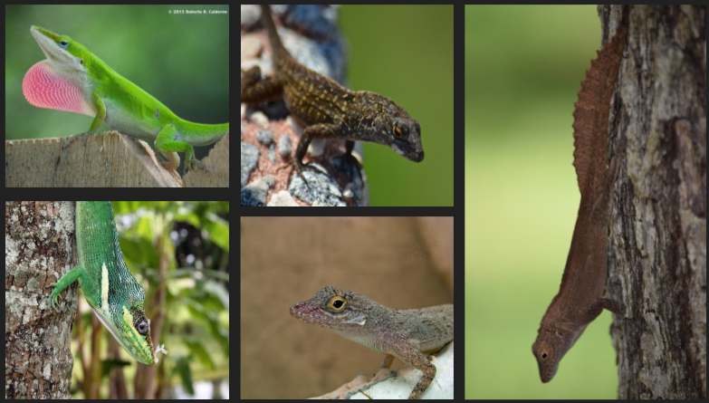

# Introduction

The Florida Anole Species Classification project aims to develop a robust machine learning pipeline for identifying five common Anolis species from photographs, primarily to support a community science initiative with middle school students in Miami. Building upon an extensive dataset of over 80,000 verified iNaturalist photographs, this project seeks to improve the current classification system, which, despite having access to substantial training data, currently achieves only 35% accuracy (compared to a random baseline of 20%). The development of this classification pipeline will serve as the foundation for a broader educational tool, whether implemented as a mobile application or web platform, that enables students to receive immediate probability-based species identification feedback before submitting their observations to iNaturalist, thereby enhancing the quality of citizen science data collection while engaging young students in herpetological research. 

  

## Method 
The improved classification system proposes a pipeline that consists of 
1) Detecting lizard species using fine-tuned lizard detection model ( :point_left: Current Progress)
2) Upscaling and enhancing cropped image 
3) Classifying lizard subspecies using Classification model trained with cropped images.

## Progress

### 1) Lizard Detection Model
- Fine-tuned multiple YOLO models using Ultralytics API
- Evaluated models' performance results
- Chose YOLOv8n model as choice of object detection model for lizards

#### Model Performance 
- **Recall** is the most important metrics because achieving high recall indicates less missed detections. This is vital because in the entire 3-stage pipeline, the object detection serves as the first model and it is responsible for detecting the target. Missing the target would mean no image gets passed downstream, resulting in no classification performed at all and affecting the entire pipeline’s result. YOLOv8n scored the best in Recall.
- The next most important metric is **mean Average Precision (mAP) at high Intersection over Union (IoU)**. In the first stage of the pipeline, we will filter predictions using a high IoU value to create a better localized bounding box around the lizard. This helps to preserve and capture the key features of the lizard in the cropped image, before being passed downstream to the classification model. Thus, we value mAP @ high IoU of 75 and 50-95. YOLOv8n achieved the 2nd highest (only differing from the top scorer by 0.007) and highest mAP for IoU of 75 and 50-95 respectively.
- **Considering the high Recall, F1-score and mAP results, YOLOv8n will be chosen as the lizard detection model.**

## Installation:
    cd Anole_classifier
    
    conda create -f requirements_window.yml
    conda install -c conda-forge cudatoolkit=11.2 cudnn=8.1.0
    pip install "tensorflow<2.11" 

## Dataset
Prepare your dataset and ensure it is organized as specified in the Dataset section. To download the raw, labelled images from iNaturalist:

The dataset used for this project consists of labeled images of different anole species. The dataset should be organized into subfolders for each species, with images in each subfolder. To download the dataset: 
1. Download the .csv file (Contains the taxonID, link, image metadata) 
2. Use the utility.py file. 
 - The file path must be changed to one of the csv files and the invoktion uncommented.

Generate dataset .csv file using the following steps:
 - navigate to iNaturalist export: https://www.inaturalist.org/observations/export
 - use queries: ?quality_grade=research&identifications=any&field%3Abanded=yes&taxon_ids%5B%5D=36488%2C36391%2C36455, ?quality_grade=research&identifications=any&field%3Abanded=yes&taxon_ids%5B%5D=116461%2C36514

Downloaded Dataset information
	Data Count (Species Name, Taxon ID, Count)

- Knight Anole (Anolis Equestris), 36391, 2301
- Crested Anole (Anolis cristatellus), 36488, 6075
- Bark Anole (Anolis distichus), 36455, 2671
- Green Anole (Anolis carolinensis), 36514, 44242 (not fully downloaded)
- Brown Anole (Anolis sagrei), 116461, 44756 (not fully downloaded)

