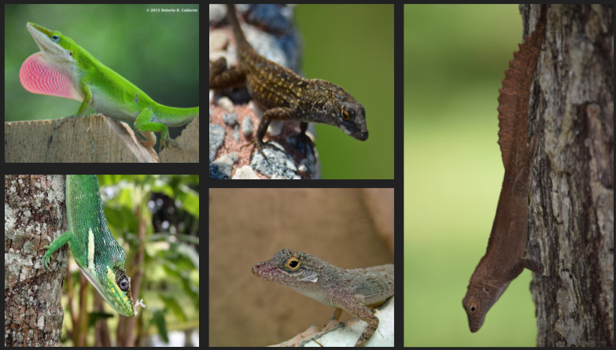
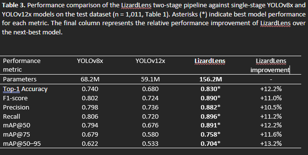
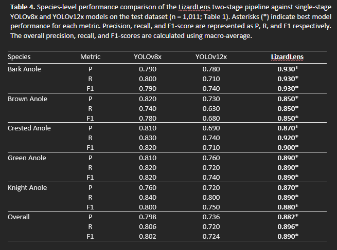
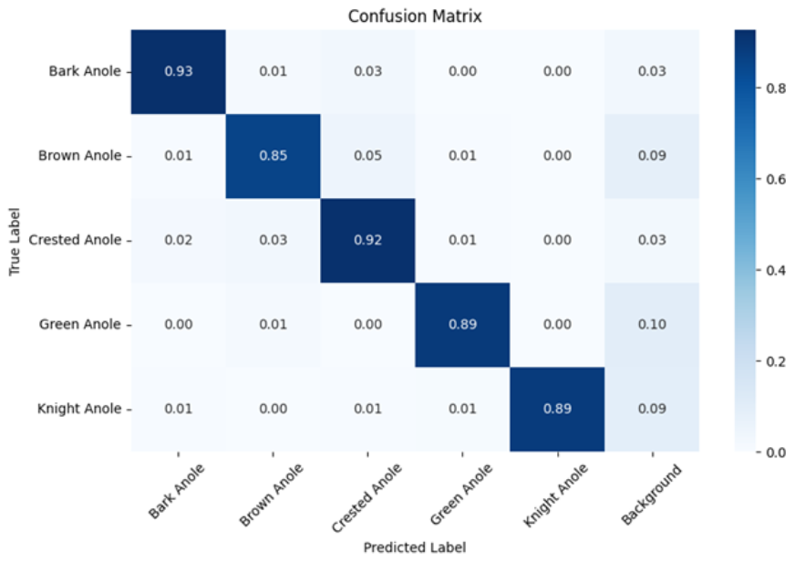
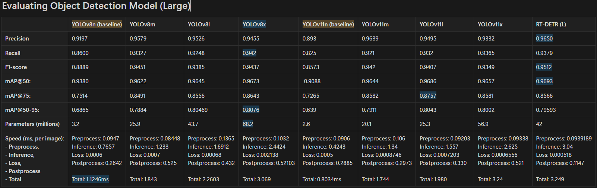
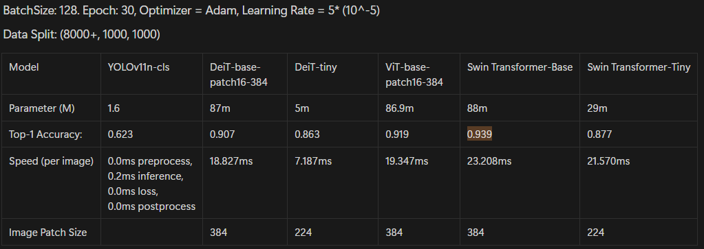
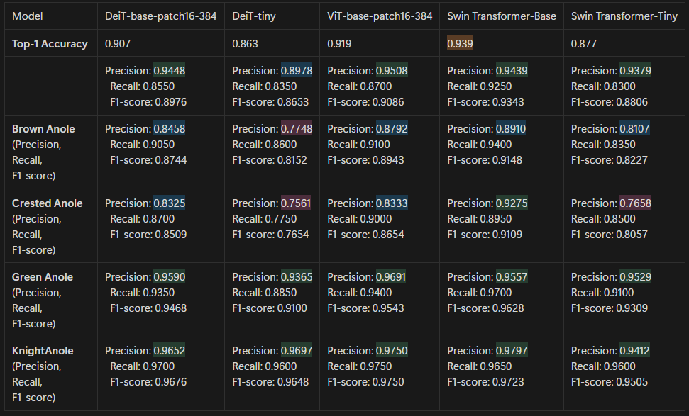

# Introduction

The Florida Anole Species Classification project aims to develop a robust machine learning pipeline for fine-grained visual classification (FGVC) of five common Anolis species found in Miami. The pipeline is designed to support a community science initiative involving middle school students, enabling them to receive immediate, probability-based species identification before submitting observations to iNaturalist. This enhances the quality of citizen science data while promoting student engagement in herpetological research.

FGVC is inherently challenging due to high inter-class similarity and high intra-class variation. For example, Brown and Bark Anoles share similar coloration and patterns, complicating inter-species differentiation. Conversely, Crested Anoles exhibit wide variations in skin color and crest morphology, complicating intra-species classification. Additionally, Anoles often appear camouflaged and occupy a small portion of the image, making their distinguishing features difficult to detect.

While prior FGVC approaches leverage attention mechanisms and feature localization techniques (e.g., Mask-CNN, Recurrent Attention-CNN) as well as modern architectures like Vision Transformers, they often fall short in handling small object detection. To address this, we propose a three-stage pipeline: (1) detect lizards using a fine-tuned object detection model, (2) crop detected regions, and (3) classify subspecies using a fine-tuned Swin Transformer. We curated a dataset of 10,000 images from iNaturalist, filtered for visibility of species-specific features, covering Bark, Brown, Crested, Green, and Knight Anoles. Our pipeline achieved a competitive <ins>top-1 accuracy of 85.6%</ins>.

  

## Method 
We proposed classification pipeline that consist of 2 stages: 
1) Detect lizard species bounding boxes using fine-tuned lizard detection model.
2) Classify lizard subspecies by passing cropped and resized images of bounding boxes to fine-tuned classification model.

## Results

#### Overall Result
Overall, the classification pipeline achieved <ins>83% top-1 accuracy </ins> and <ins>89% f1-score</ins>, which are significantly higher than other single-stage, off-the-shelf fine-tuned models (image 1). 

  

The precision, recall and f1-score of each class is shown in the image below. 
- Generally, the pipeline achieved <ins>high f1-score (above 85%)</ins> across all anole classes as compared to other fine-tuned models

  

  

Next, we will go into the details of the results of each stage of the pipeline as well as the rationale for the chosen metric and models.

#### Stage 1 - Lizard Detection Model

  

- **Recall** - YOLOv8x scored the best with a <ins>recall value of 86%</ins>. Recall is the most important metrics because achieving high recall indicates less missed detections. This is vital because in the entire 3-stage pipeline, the object detection serves as the first model and it is responsible for detecting the target. Missing the target would mean no image gets passed downstream, resulting in no classification performed at all and affecting the entire pipeline’s result. 
- **mean Average Precision (mAP) at high Intersection over Union (IoU)** is the next most important metric. In the first stage of the pipeline, we will filter predictions using a high IoU value to create a better localized bounding box around the lizard. This helps to preserve and capture the key features of the lizard in the cropped image, before being passed downstream to the classification model. Thus, we value mAP @ high IoU of 50-95. YOLOv8x emerged as the top performer with the highest mAP for IoU of 50-95.
- **Considering the high Recall, F1-score and mAP results, YOLOv8x was chosen as the lizard detection model.**

#### Stage 2 - Classification Model
From the images below, the Swin Transformer (Base) model was the most performant classification model with a score of <ins>93.9% for Top-1 accuracy</ins>. Furthermore, it achieved highest number of classified classes with above 90% precision (as highlighted in green). Therefore, the fine-tuned Swin Transformer (Base) model was chosen as the classification model for cropped lizard images.

  

  

## Installation:
    cd Anole_classifier
    
    conda create -f requirements_window.yml
    conda install -c conda-forge cudatoolkit=11.2 cudnn=8.1.0
    pip install "tensorflow<2.11" 

## Dataset 
The dataset are categorized as such:

**Original Dataset**

- Name: [original_compressed](https://gtvault-my.sharepoint.com/:f:/g/personal/wchia7_gatech_edu/EslddAlvkiFIh6r50UyBh8MBzS3tVwwrRXStT9aDARu8gQ?e=2bbj8W)
- Purpose:
	- Contains the original images sourced from the iNaturalist database.
	- Dataset only contains images that shows distinct features of the anole species. Distinct features are validated by researcher. 
	- Split into 5 individual classes of 2000 counts
- Directory
	- bark_anole, brown_anole, crested_anole, green_anole, knight_anole
		- Images and labels
	    
**YOLO Object detection Training**

- Name: [lizard_10000_v2](https://gtvault-my.sharepoint.com/:u:/g/personal/wchia7_gatech_edu/EZ1vNlKDSLxDhUXPM3QCkIQB_yG2ge26Now7bylg9b1KWg?e=1CeWSx)
- Purpose:
	- Contains anole images from the original dataset. Re-organized into COCO format for YOLO detection models training. 
- Description:	
	- Each folder has same number of counts from each class.
	- But all labels contains “lizard” class and bounding box coord.
- Directory:
	- Train / Valid / Test (8000, 1000, 1000)
    	- Images / Labels
	    
**Classification Training**

- Name: [cropped_lizard_10000](https://gtvault-my.sharepoint.com/:u:/g/personal/wchia7_gatech_edu/EbSmMeZ4fAtPleRnmkD32ogB4HBcJ2u-6y9Jp9kWzvAedw?e=7OOMyk)
- Purpose:
	- Contains anole images from the original dataset. Re-organized into format suitable for classification model training from Ultralytics or HuggingFace API.
- Description:
	- No labelling needed, only provided folders of images
- Directory:
	- Train / Valid / Test
    		- bark_anole, brown_anole, crested_anole, green_anole, knight_anole
	    
**End-to-end Dataset (florida_five_anole)**

- Name: [florida_five_anole_10000](https://gtvault-my.sharepoint.com/:u:/g/personal/wchia7_gatech_edu/EbSmMeZ4fAtPleRnmkD32ogB4HBcJ2u-6y9Jp9kWzvAedw?e=7OOMyk)
- Purpose:
	- The primary dataset for validating the performance of the 3 stage pipeline (Lizard Detection -> Crop -> Classification)  
- Description:
	- Similar layout to YOLO Object Detection training dataset
	- But all labels contains the respective class name and bounding box coord.
- Directory:
	- Train / Valid / Test (8000, 1000, 1000)
	    - Images / Labels
	- Data.yaml / Test_data.yaml
	    - Labels:
		- 0: ‘bark_anole’
		- 1: ‘brown_anole’
		- 2: ‘crested_anole’
		- 3: ‘green_anole’
		- 4: ‘knight_anole’

## Fine-tuned Models 
**Fine-tuned YOLOv8n model:**
- Name: [Fine-tuned YOLOv8n lizard detector](https://gtvault-my.sharepoint.com/:u:/g/personal/wchia7_gatech_edu/ETkmK6TrKlNPhkzx88G9AUoBv-PDbFRwEKaAbgrfKhE5lQ?e=4qUQsR)
- Model has been fine-tuned with the lizard_10000_v2 dataset.
- Specifically fine-tuned to detect "lizard" classes only.

**Fine-tuned Swin Transformer model:**
- Name: [Fine-tuned Swin Transformer](https://gtvault-my.sharepoint.com/:u:/g/personal/wchia7_gatech_edu/ETABzhaa2ZVEpzEQEvaOtJcB_9788D31SoEh7OdVsv5eWQ?e=dtU1zF)
- Model has been fine-tuned with the cropped_lizard_10000 dataset.
- Model will classify input cropped images under one of the following classes:
	- 0: ‘bark_anole’
	- 1: ‘brown_anole’
	- 2: ‘crested_anole’
	- 3: ‘green_anole’
	- 4: ‘knight_anole’

## Training and Evaluation

### Dataset preparation
- Download the datasets and store them in the `./Dataset` directory.
- The end-to-end pipeline evaluation expects the test split of the `florida_five_anole_10000_v4` dataset, with images and YOLO-format labels at:
	- `INPUT_IMAGE_FOLDER`: `../Dataset/yolo_training/florida_five_anole_10000_v4/test/images`
	- `INPUT_LABEL_FOLDER`: `../Dataset/yolo_training/florida_five_anole_10000_v4/test/labels`

### Stage 1 - Lizard Detection Model Training
- Fine-tune the YOLOv8x detection model using `./Spring_2025/notebooks/object_detection_train yolov8x_dataset_v4_pipeline.ipynb`.
- Training configuration (per the notebook):
	- Base weights: `yolov8x.pt`
	- Epochs: 100
	- Image size: 640
	- Batch size: 48
- Validation on the test dataset reports mAP@0.50, mAP@0.75, mAP@0.50-0.95, precision, recall, F1-score, and inference speed.
- Alternative detection backbones (YOLOv8 small/medium/large/extra-large, YOLOv11, YOLOv12) can be trained via the other `object_detection_train_*.ipynb` notebooks in the same folder.

### Stage 2 - Classification Model Training
- Fine-tune the Swin Transformer (Base) classifier on the cropped lizard dataset using `./Spring_2025/notebooks/classification_train_hugging_face.ipynb`.
- Training configuration (per the notebook):
	- Base checkpoint: `microsoft/swin-base-patch4-window12-384`
	- Epochs: 30
	- Per-device batch size: 128
	- Gradient accumulation steps: 4
	- Learning rate: 5e-5
	- Warmup ratio: 0.1
	- Best model selected by validation accuracy (`metric_for_best_model="accuracy"`, `load_best_model_at_end=True`)
- Augmentations: `RandomResizedCrop` and `RandomHorizontalFlip` followed by ImageNet normalization for training; `Resize` + `CenterCrop` + normalization for validation.
- An Ultralytics-based classification training option is also provided in `classification_train_yolo.ipynb`.
- Each training notebook also produces evaluation against the test split, reporting precision, recall, F1-score, and a confusion matrix.

### End-to-end evaluation of LizardLens (pipeline)
- Place the fine-tuned YOLOv8x and Swin Transformer weights so that `pipeline_evaluation.py` can load them via the module-level paths at the top of the file:
	- `YOLO_MODEL_FILE_PATH` -> path to the YOLOv8x `best.pt`
	- `SWIN_MODEL_FILE_PATH` -> path to the fine-tuned Swin Transformer checkpoint directory
- Update the evaluation thresholds at the top of `pipeline_evaluation.py` as needed:
	- `CONF_THRESH` (default `0.5`) - YOLO detections below this confidence are discarded
	- `NMS_IOU_THRESHOLD` (default `0.25`) - IoU threshold for non-maximum suppression; overlapping detections are grouped and only the highest-confidence box per group is kept
	- `TOP_K` (default `5`) - maximum number of detections per image passed to the classifier (set `None` for no limit)
	- `EVAL_IOU_THRESHOLD` (default `0.2`) - minimum IoU required between a prediction and a ground-truth box for them to be matched during evaluation
- Run the pipeline:
	- `python pipeline_evaluation.py`, or run `pipeline_evaluation.ipynb` / `pipeline_evaluation_pipeline.ipynb`
- Pipeline behaviour, per image in the test set:
	1. YOLOv8x predicts bounding boxes; detections are filtered by `CONF_THRESH`, deduplicated via NMS at `NMS_IOU_THRESHOLD`, sorted by confidence, and trimmed to the top `TOP_K`.
	2. Each surviving box is cropped and classified by the fine-tuned Swin Transformer.
	3. Predictions are greedy-matched to ground-truth boxes using IoU >= `EVAL_IOU_THRESHOLD`; matched (y_true, y_pred) pairs are recorded.
	4. Unmatched ground-truth boxes are recorded as **missed detections** (`y_pred = MISSED_CLASS_ID = 5`).
	5. Unmatched predictions are recorded as **false positives** (`y_true = MISSED_CLASS_ID = 5`).
	6. Matched predictions whose class differs from the ground-truth class are additionally saved as **misclassifications**.
- Outputs are written to a new run directory `./inference/run_<YYYYMMDD_HHMMSS>/`:
	- `eval_results.csv` - `(y_true, y_pred)` pairs for every detection across the test set
	- `annotated_images/` - every test image annotated with ground-truth boxes (blue) and predicted boxes (red, with predicted class and detection confidence)
	- `missed_detections/` - annotated copies of images containing at least one unmatched ground-truth box
	- `false_positives/` - annotated copies of images containing at least one unmatched prediction
	- `mis_classification/` - annotated copies of images where a matched prediction had the wrong class
	- A scikit-learn `classification_report` printed to stdout, with per-class precision, recall, and F1 across the five anole classes plus a `Background` row that aggregates missed detections and false positives.

### End-to-end evaluation of other models
- Place alternative detection or classification weights in the same directory referenced by `YOLO_MODEL_FILE_PATH` / `SWIN_MODEL_FILE_PATH` and update the paths at the top of `pipeline_evaluation.py`.
- Variants of the pipeline evaluation notebook are provided for other detection backbones, e.g. `pipeline_evaluation_yolov8.ipynb` and `pipeline_evaluation_yolov12.ipynb`. Each follows the same overall structure as `pipeline_evaluation.py`.
